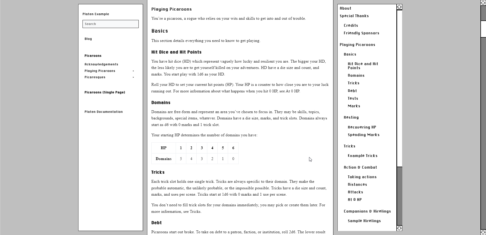

# System Platen Theme

## Installation

Type this in your site directory.

`go get github.com/cyberselkise/system-platen-theme`

Put this in your config.yaml or hugo.yaml file. This path should be at the top.

```yaml
module:
  imports:
    - path: github.com/cyberselkie/system-platen-theme
```

## Examples

[Live Preview](https://system-platen-theme.netlify.app/)

(the image resolution is messed up right now, click on the image to see it properly)


